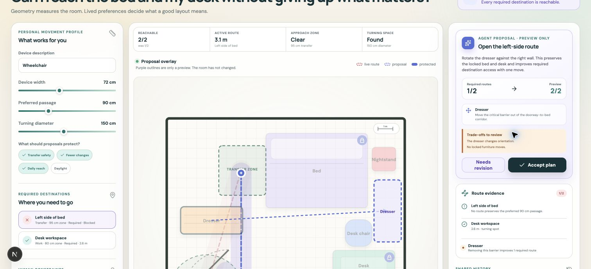

# HomeWheel

HomeWheel is a wheelchair-aware room planner for the OpenAI WebMCP Challenge.
It lets a person and a browser agent reason over the same live room—not a
screenshot or a text description.

It is an independent personal project by Andrea Balbo.

The person defines their movement envelope, destinations, and non-negotiable
constraints. The agent measures routes, identifies barriers, and creates an
exact layout proposal. The room changes only after the person accepts it.

[Try the live HomeWheel demo](https://homewheel-webmcp.andreabalbo94.chatgpt.site)

[Watch the 72-second narrated demo](https://youtu.be/gga0UbnX4PY)



## The idea

Furniture placement is personal. A geometrically valid answer can still be
wrong because a drawer faces the wrong direction, a transfer side must remain
open, or a desk cannot leave its outlet.

HomeWheel makes that disagreement useful:

1. The agent reads structured room geometry and route evidence.
2. It previews a small set of collision-checked furniture moves.
3. The person accepts the plan or rejects it with a lived constraint.
4. That feedback becomes structured context for the next proposal.

This creates a visible human-agent negotiation instead of silent automation.

## Why WebMCP matters

A text-only assistant can say “move the dresser,” but it cannot reliably know
the room state, preserve protected objects, simulate every required route, or
show the exact result inside the application.

HomeWheel exposes eight page-native tools:

- `get_workspace_state`
- `set_mobility_profile`
- `simulate_routes`
- `find_barriers`
- `create_layout_proposal`
- `set_object_constraint`
- `compare_layouts`
- `restore_layout`

`create_layout_proposal` is intentionally proposal-only. It returns before/after
metrics and renders a preview overlay, but never changes the live layout. Human
acceptance happens in the interface.

## Prototype features

- Two authored demo scenarios plus a customizable room
- Evidence-grounded user stories with public research sources
- Editable room dimensions, door, furniture, and route destinations
- Personal device width, preferred passage, and turning diameter
- Explicit priorities such as transfer safety, fewest moves, daily reach, and
  daylight
- Multi-destination A* route simulation
- Purpose-specific transfer, work, and reach zones at each destination
- Turning-space, approach-zone, and route-length evidence
- Protected and stability-critical furniture with human-readable reasons
- Agent proposal previews with exact moves and trade-offs
- Accept, reject, and feedback-aware revision loop
- Shared activity history, undo, baseline comparison, and JSON export
- Pointer and keyboard furniture movement
- Responsive, labeled, reduced-motion-friendly interface
- Local persistence with no account or backend required

## Architecture

The prototype is a static Next.js application. Geometry, route simulation, and
proposal validation run in the browser.

```text
Person sets needs and constraints
              ↓
WebMCP agent reads live workspace
              ↓
Agent simulates routes and proposes exact moves
              ↓
HomeWheel validates collisions and protected objects
              ↓
Person accepts or returns structured feedback
```

The agent and direct-manipulation UI use the same application state, so every
decision is visible and reversible.

## User-story acceptance criteria

The public stories are implemented as product requirements, not just copy:

| User need | HomeWheel must |
| --- | --- |
| Protect my transfer side | Render and validate a clear transfer zone on the chosen side, block proposals that occupy it, and refuse to move stability-critical furniture. |
| Use my actual movement | Recalculate every route and approach zone from the person’s chair width, preferred passage, turning diameter, destination purpose, side, and clearance depth. |
| Let me define what better means | Expose personal priorities to both the interface and WebMCP state, preserve protected objects, preview exact trade-offs, and require explicit acceptance before changing the room. |

## Responsible scope

HomeWheel is a personal design and conversation aid. It does not certify
building-code compliance, accessibility compliance, or medical suitability.
Real-world decisions should include the person who uses the room and, when
appropriate, an occupational therapist or access professional.

## Local development

```bash
npm install
npm run dev
```

Open `http://localhost:3000` in a browser with WebMCP support. The interface
also works as a direct-manipulation planner in an ordinary browser.

## Verification

```bash
npm run check
```

## Recommended demo

Start in the Bedroom scenario and ask:

> Review every required destination. Preserve all locked objects and personal
> constraints. Identify the smallest useful set of furniture changes, then
> create a layout proposal for review—do not directly alter the room.

Reject the first proposal with:

> The dresser drawers must keep facing the bed, and I need the chair side to
> remain open.

Then ask the agent to read the updated workspace and create a revision that
explicitly responds to the latest feedback.

The complete submission copy and video plan are in
[`SUBMISSION.md`](./SUBMISSION.md).

## Public research basis

HomeWheel’s sample stories are composite scenarios, not product testimonials.
They are grounded in:

- [United Spinal’s account of Kelly’s accessible studio](https://unitedspinal.org/accessibility-ideas-studio-apartment/),
  including transfer-side space and keeping the bed stable during transfers
- [Focus groups on wheelchair transfers and the built environment](https://pubmed.ncbi.nlm.nih.gov/25986519/)
- [A qualitative study of wheelchair users’ home usability](https://pmc.ncbi.nlm.nih.gov/articles/PMC10792724/)
